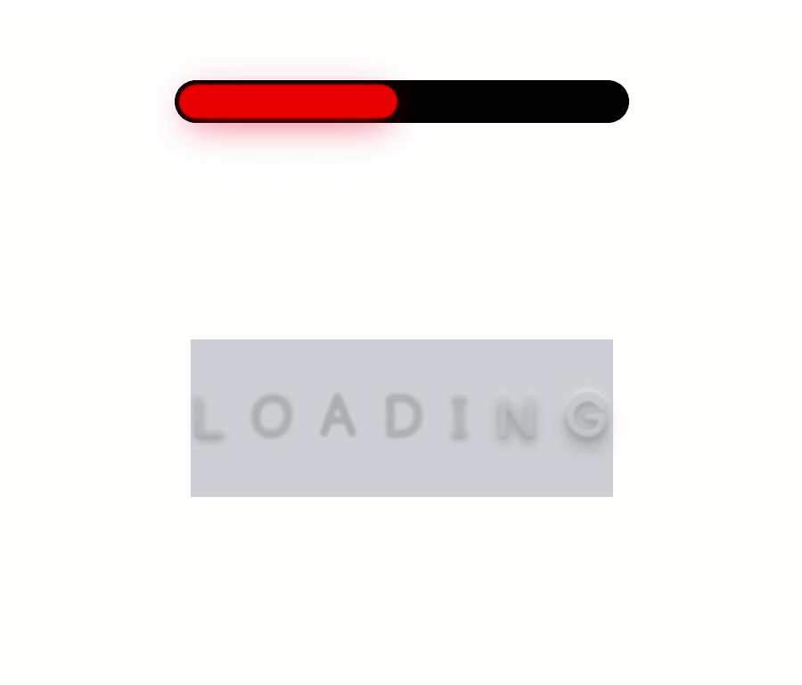

<h1 align="center">
    
</h1>

## 💻 About project

A list of some cool examples of loadings which you can use in your web applications or in your mobile app. I'm going to continually add new loadings to this list and if you wanna contribute, you surely can do it.

## 🛠 Technology

#### **Web Content**

-   **[HTML5](https://developer.mozilla.org/pt-BR/docs/Web/HTML/HTML5)**
-   **[CSS3](https://www.w3schools.com/css/)**

#### **Utilitaries**

-   Editor: **[Visual Studio Code](https://code.visualstudio.com/)**;
-   Font: **[Balsamiq Sans](https://fonts.googleapis.com/css2?family=Balsamiq+Sans&display=swap)**

### Prerequisites

Before you begin, you will need to have the following tool installed on your machine:
[Git](https://git-scm.com)

In addition, it is good to have an editor to work with the code as [VSCode][https://code.visualstudio.com/]

### Running the application

```bash
# Clone this repository
$ git clone https://github.com/luizmr/loadings-content

# Access the project folder in the cmd/terminal
$ cd loadings-content

# Just open .html file with live server or run in terminal
$ npx http-server
```

## 📝 License

This project is under the MIT license.

Made with ❤️ by Luiz Marcelo Rocha
